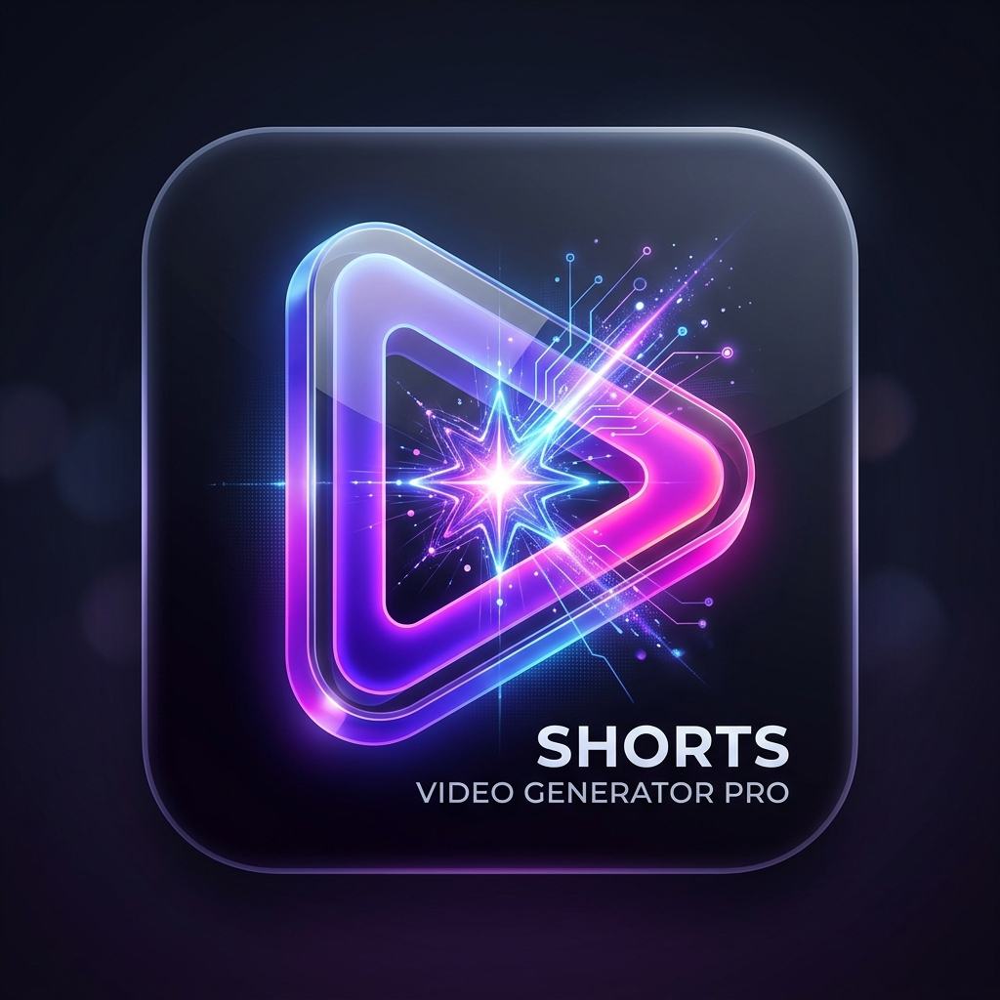

  

# Shorts Video Generator PRO v1.8.2

## 🌟 主な機能 (v1.8.2)
- **高速並列レンダリング (v1.8.2)**: 音声合成、画像生成、動画エンコードをパイプライン実行し、書き出し時間を劇的に短縮。
- **インテリジェント・エディタ**: 生成された台本を直接編集、シーンの追加・削除が可能。
- **AI文章洗練機能**: ワンクリックでナレーションとテロップをプロ仕様にブラッシュアップ。
- **文字数指定機能**: 目標文字数（±10%）に合わせた精密な台本作成。
- **長尺動画対応**: 15秒のショートから最大60分の動画まで生成可能。
- **完全オフライン**: プライバシーを重視し、外部APIに依存せず動作。

## 🚀 クイックスタート
1. `ShortsGeneratorApp.exe` を起動します。
2. ブログのURLまたはテキストを入力します。
3. 文字数や時間、画面方向を設定し「生成」をクリック。
4. 必要に応じてAIで文章を洗練させ、「動画を書き出し」をクリックして完成！

## 🛠 動作環境
- **OS**: Windows 10/11 (x64)
- **GPU**: NVIDIA GeForce GTX 1650 以上推奨 (VRAM 4GB+)
- **依存関係**: FFmpeg (自動ダウンロード機能搭載)

## 📦 開発
- **言語**: C# (.NET 10)
- **フレームワーク**: WPF, FFMpegCore, StableDiffusion.NET

---
Developed by Antigravity AI
